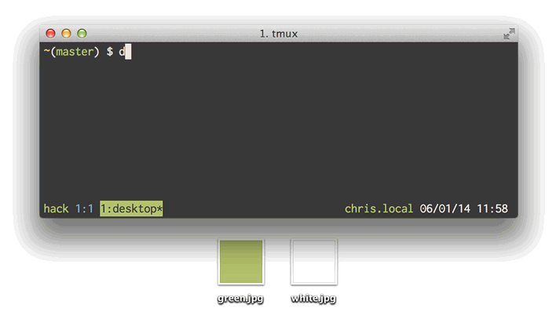

# Desktop

### A decent way to change your desktop image.

Since the introduction of
[Spaces](http://en.wikipedia.org/wiki/Spaces_(software)) in Mac OS X, changing
the desktop image has been a chore for those of us who enjoy the same image on
all spaces and monitors; each has its own image that must be updated
individually. Lucky for you, a recent breakthrough in technology had made changing
your desktop **drag-n-drop easy**.

**desktop** lets us update the desktop image on every space and monitor *at the
same time* from the command line.



## Installation

**desktop** can be installed from [RubyGems](http://rubygems.org/gems/desktop).

```bash
$ gem install desktop
```

## Usage

Usage can be seen from the command line:

```bash
$ desktop help
Commands:
  desktop help [COMMAND]  # Describe available commands or one specific command
  desktop set IMAGE_PATH  # Set all desktops to the image at IMAGE_PATH
  desktop version         # Show gem version
```

Desktop images can be set using a file path:

```bash
$ desktop set /path/to/image.jpg
```

Or a web URL:

```bash
$ desktop set http://desktops.amazing/image.jpg
```

The `set` command is optional:

```bash
$ desktop /path/to/image.jpg
```

### Usage in your awesome app

Want to include the features of **desktop** in your awesome app? Please do!

Add the gem to your Gemfile:

```ruby
gem 'desktop'
```

Require the library:

```ruby
require 'desktop'
```

And use the same CLI interface that you already know:
```ruby
Desktop::CLI.start %w[set path/to/image.jpg]
```

## Where can I get desktops?

[**Simple Desktops**](http://simpledesktops.com) - A collection of wallpapers
curated by [Tom Watson](http://tmwtsn.com) designed to make your computer
beautiful without distraction.

[](http://simpledesktops.com)

[**Vladstudio**](http://www.vladstudio.com/wallpapers) - The project of Russian
digital artist [Vlad Gerasimov](http://www.vladstudio.com/blog). He creates
wallpapers for computers and mobile devices.

[](http://www.vladstudio.com/wallpapers)

## Contributing
Please see the [Contributing
Document](https://github.com/chrishunt/desktop/blob/master/CONTRIBUTING.md)

## Changelog
Please see the [Changelog
Document](https://github.com/chrishunt/desktop/blob/master/CHANGELOG.md)

## License
Copyright (C) 2014 Chris Hunt, [MIT
License](https://github.com/chrishunt/desktop/blob/master/LICENSE.txt)
